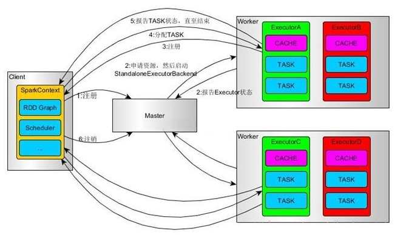
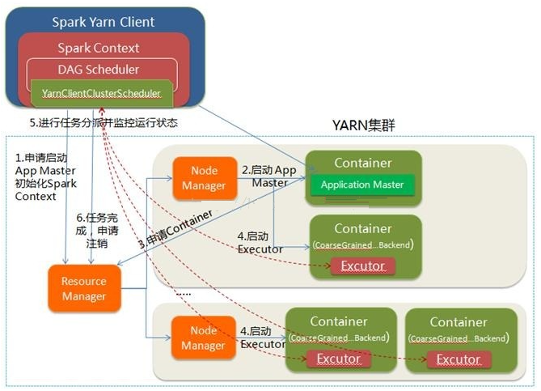
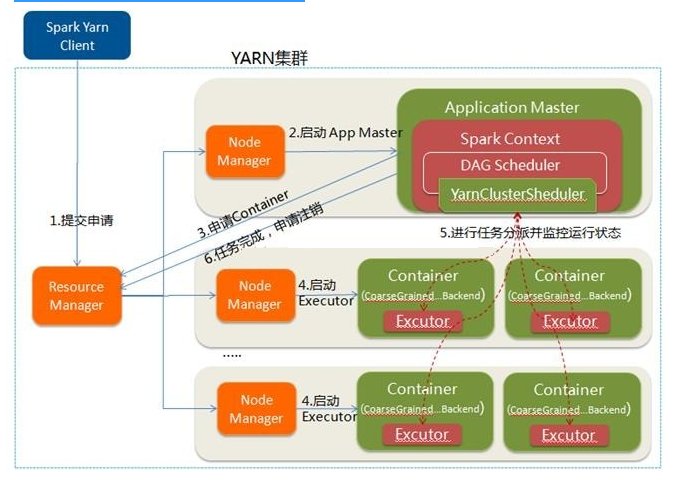
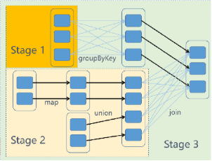

# Spark
---

## Spark 简介

Spark是基于弹性分布式数据集(RDD)模型，具有良好的通用性，容错性与并行处理数据的能力。

RDD(Resilient Distributed Dataset)：弹性扽不是数据集，本质是数据集的描述(只读的，可分区的分布式数据集)，不是数据本身。

相同 hive、hadoop 用于离线数据计算。

优缺点


spark： 最大利用内存cache，中间结果存放在内存，加速迭代


# Spark和hadoop作业区别
理解算子的概念

多进程和多线程：
    多进程：方便控制资源，独享进程空间，但是消耗更多启动时间，不适合运行低延迟的作业，导致MR的时效性差。
    多线程：任务启动速度快；同节点上的任务同属一个进程，共享内存->适合内存密集写入（加载大量词表的程序）；同节点所有任务运行在jvm进程（executor），Executor所占资源被多批任务调用（也就是不需要重复加载相同数据）。不稳定。

## Spark 安装

    1、tar zxvf spark-3.2.1-bin-hadoop2.7.tgz 
    2、mv spark-3.2.1-bin-hadoop2.7.tgz /usr/local/src/spark
    3、set spark environment
        vim ~/.bashrc
    
        # set spark environment
        export SPARK_HOME=/usr/local/src/spark
        export PATH=$PATH:${SPARK_HOME}/bin
    4、验证，spark-shell,
        Using Spark's default log4j profile: org/apache/spark/log4j-defaults.properties
        Setting default log level to "WARN".
        To adjust logging level use sc.setLogLevel(newLevel). For SparkR, use setLogLevel(newLevel).
        22/01/17 21:03:08 WARN NativeCodeLoader: Unable to load native-hadoop library for your platform... using builtin-java classes where applicable
        Spark context Web UI available at http://master:4040
        Spark context available as 'sc' (master = local[*], app id = local-1642424591905).
        Spark session available as 'spark'.
        Welcome to
        Using Scala version 2.12.15 (Java HotSpot(TM) 64-Bit Server VM, Java 1.8.0_172)
        Type in expressions to have them evaluated.
        Type :help for more information.
    
        :quit 退出
    4、在其他节点做相同的配置
    
    cd $SPARK_HOME/conf
    
    cp spark-env.sh.template spark-env.sh
    
    export SCALA_HOME=/usr/local/src/scala-2.12.15
    export JAVA_HOME=/usr/lib/jvm/java
    export HADOOP_HOME=/usr/local/src/hadoop
    export HADOOP_CONF_DIR=$HADOOP_HOME/etc/hadoop
    export SPARK_YARN_USER_ENV="CLASSPATH=/usr/local/src/hadoop/etc/hadoop"
    SPARK_MASTER_IP=master
    SPARK_LOCAL_DIRS=/usr/local/src/spark
    SPARK_DRIVER_MEMORY=1G
    
    cp workers.template workers
    
    添加slave1，slave2

    5、进入mysql给所有slave权限，以免后期用yarn找不到报表。

    grant all privileges on *.* to ‘root'@'%' identified by '123456' with grant option;
    flush privileges;
    
    6、配置日志输出信息：
    在项目resources中创建 log4j.properties

    log4j.rootCategory=ERROR, console
    log4j.appender.console=org.apache.log4j.ConsoleAppender
    log4j.appender.console.target=System.err
    log4j.appender.console.layout=org.apache.log4j.PatternLayout
    log4j.appender.console.layout.ConversionPattern=%d{yy/MM/dd HH:mm:ss} %p %c{1}: %m%n
    # Set the default spark-shell log level to ERROR. When running the spark-shell, the
    # log level for this class is used to overwrite the root logger's log level, so that
    # the user can have different defaults for the shell and regular Spark apps.
    log4j.logger.org.apache.spark.repl.Main=ERROR
    # Settings to quiet third party logs that are too verbose
    log4j.logger.org.spark_project.jetty=ERROR
    log4j.logger.org.spark_project.jetty.util.component.AbstractLifeCycle=ERROR
    log4j.logger.org.apache.spark.repl.SparkIMain$exprTyper=ERROR
    log4j.logger.org.apache.spark.repl.SparkILoop$SparkILoopInterpreter=ERROR
    log4j.logger.org.apache.parquet=ERROR
    log4j.logger.parquet=ERROR
    # SPARK-9183: Settings to avoid annoying messages when looking up nonexistent UDFs in SparkSQL with Hive support
    log4j.logger.org.apache.hadoop.hive.metastore.RetryingHMSHandler=FATAL log4j.logger.org.apache.hadoop.hive.ql.exec.FunctionRegistry=ERROR


## Spark三种运行模式

### Local模式

所谓的Local模式就是不需要其他任何节点的资源就可以在本地执行spark代码的环境。一般用于调试等。

cd $SPARK_HOME

./bin/spark-shell 即可输入Scala命令。其中的sc即为spark context。

### Standalone模式

独立部署模式。只是用spark自身节点来运行集群模式。是经典的master-slave模式，不启动其他框架。

---

配置：

spark3.1.2 版本之前 修改 slaves.template -> slaves
spark3.1.2 版本之后 修改 work.template -> workers
并添加work节点 master ，slave1，slave2 节点。

修改 spark-env.sh 添加 JAVA_HOME和集群对应的master节点

    # spark standaloone mode
    export JAVA_HOME=/usr/lib/jvm/java
    SPARK_MASTER_HOST=master
    SPARK_MASTER_PORT=7077

master:8080即可查看webUI


提交任务执行的时候会多启动两个进程
1589 Worker
**1959 CoarseGrainedExecutorBackend**       计算节点
1502 Master
1982 Jps
**1887 SparkSubmit**        提交节点

#### 任务流程


1、SparkContext连接到Master，向Master注册并申请资源（CPU Core 和Memory）
Master根据SparkContext的资源申请要求和Worker心跳周期内报告的信息决定在哪个Worker上分配资源，然后在该Worker上获取资源，然后启动StandaloneExecutorBackend；

2、StandaloneExecutorBackend向SparkContext注册；

3、SparkContext将Applicaiton代码发送给StandaloneExecutorBackend；并且SparkContext解析Applicaiton代码，构建DAG图，并提交给DAG Scheduler分解成Stage（当碰到Action操作时，就会催生Job；每个Job中含有1个或多个Stage，Stage一般在获取外部数据和shuffle之前产生），然后以Stage（或者称为TaskSet）提交给Task Scheduler，Task Scheduler负责将Task分配到相应的Worker，最后提交StandaloneExecutorBackend执行；

4、StandaloneExecutorBackend会建立Executor线程池，开始执行Task，并向SparkContext报告，直至Task完成

5、所有Task完成后，SparkContext向Master注销，释放资源


#### 配置历史服务

vim spark-default.conf
spark.eventLog.enabled           true
spark.eventLog.dir               hdfs://master:9000/spark-history

---
vim spark-env.sh

export SPARK_HISTORY_OPTS="
-Dspark.history.ui.port=18080
-Dspark.history.fs.logDirectory=hdfs://master:9000/spark-history
-Dspark.history.retainedApplications=30"

⚫ 参数1含义:WEBUI访问的端口号为18080
⚫ 参数2含义:指定历史服务器日志存储路径
⚫ 参数3含义:指定保存Application历史记录的个数，如果超过这个值，旧的应用程序信息将被删除，这个是内存中的应用数，而不是页面上显示的应用数。
 
 #### 高可用HA 
 TODO 后续在更新zookeeper安装及配置

### Yarn模式

spark属于计算框架，资源管理框架交个专业的来管理会更加高效，所以引入了Yarn环境。

配置：

修改hadoop中yarn-site.xml 
```    <!-- 关闭虚拟内存检查-->
    <property>
            <name>yarn.nodemanager.pmem-check-enabled</name>
            <value>false</value>
            <description>是否启动一个线程检查每个任务正使用的物理内存量，如果任务超出分配值，则直接将其杀掉，默认为true</description>
    </property>
    <property>
            <name>yarn.nodemanager.vmem-check-enabled</name>
            <value>false</value>
            <description>是否启动一个线程检查每个任务正使用的虚拟内存量，如果任务超出分配值，则直接将其杀掉，默认是true</description>
    </property>
```

修改spark-env.sh 需要注释掉standalone的配置。

```
# spark yarn mode
export HADOOP_HOME=/usr/local/src/hadoop
export HADOOP_CONF_DIR=$HADOOP_HOME/etc/hadoop
YARN_CONF_DIR=$HADOOP_HOME/etc/hadoop
```

配置历史服务同上，但需要spark关联yarn的历史服务
```
spark.yarn.historyServer.address=master:18080
spark.history.ui.port=18080
```

提交命令：
```
bin/spark-submit \
--class org.apache.spark.examples.SparkPi \
--master local[2] \
./examples/jars/spark-examples_2.12-3.0.0.jar \
10
```

--class 表示要执行的程序的主类
--master 部署模式 默认为本地模式，local[num] num表示分配虚拟cpu的数量，spark://master:7077,Yarn
--executor-memory 1G 每个executor的内存大小
*.jar 表示应用程序的jar包,这个url最好集群中全局可见
(application-arguments) 10 表示应用程序入口参数，用于设定当前应用的任务数量

#### 两种运行流程

##### client


1、Driver在任务提交的本地机器上运行。

2、Driver启动后，向YARN的ResourceManager申请启动Application Master。同时在SparkContent初始化中将创建DAGScheduler和TASKScheduler等，由于我们选择的是Yarn-Client模式，程序会选择YarnClientClusterScheduler和YarnClientSchedulerBackend

3、ResourceManager收到请求后，在集群中选择一个NodeManager，为该应用程序分配第一个Container（运行资源，包括cpu，内核，内存等），要求它在这个Container中启动应用程序的ApplicationMaster（所以说AM也是一个特殊的容器），与YARN-Cluster区别的是在该ApplicationMaster不运行SparkContext，只与SparkContext进行联系进行资源的分派。

4、Driver中的SparkContext初始化完毕后，与ApplicationMaster建立通讯，向ResourceManager注册，根据任务信息向ResourceManager申请资源（Container）。

5、一旦ApplicationMaster申请到资源（也就是Container）后，便与对应的NodeManager通信，要求它在获得的Container中启动CoarseGrainedExecutorBackend，CoarseGrainedExecutorBackend启动后会向Driver中的SparkContext注册并申请Task

6、driver中的SparkContext分配Task给CoarseGrainedExecutorBackend执行，

7、执行到Action算子时，触发一个JOB，根据宽窄以来划分stage，每个stage生成对应的TaskSet，然后分配到各个executor上执行。CoarseGrainedExecutorBackend运行Task并向Driver汇报运行的状态和进度，以让driver随时掌握各个任务的运行状态，从而可以在任务失败时重新启动任务

8、应用程序运行完成后，Client的SparkContext向ResourceManager申请注销并关闭自己

##### cluster


1、Spark Yarn Cluster 向YARN中提交应用程序，包括ApplicationMaster程序、启动ApplicationMaster的命令、需要在Executor中运行的程序等。

2、ResourceManager收到请求后，在集群中选择一个NodeManager，为该应用程序分配第一个Container，要求它在这个Container中启动应用程序的ApplicationMaster，**其中ApplicationMaster进行SparkContext等的初始化** 此时的AM就是Driver。

3、ApplicationMaster向ResourceManager注册，这样用户可以直接通过ResourceManage查看应用程序的运行状态，然后它将采用轮询的方式通过RPC协议为各个任务申请资源，并监控它们的运行状态直到运行结束。

4、一旦ApplicationMaster申请到资源（也就是Container）后，便与对应的NodeManager通信，要求它在获得的Container中启动CoarseGrainedExecutorBackend，CoarseGrainedExecutorBackend启动后会向ApplicationMaster中的SparkContext注册并申请Task。这一点和Standalone模式一样，只不过SparkContext在Spark Application中初始化时，使用CoarseGrainedSchedulerBackend配合YarnClusterScheduler进行任务的调度，其中YarnClusterScheduler只是对TaskSchedulerImpl的一个简单包装，增加了对Executor的等待逻辑等

5、ApplicationMaster中的SparkContext分配Task给CoarseGrainedExecutorBackend执行，CoarseGrainedExecutorBackend运行Task并向ApplicationMaster汇报运行的状态和进度，以让ApplicationMaster随时掌握各个任务的运行状态，从而可以在任务失败时重新启动任务

6、应用程序运行完成后，ApplicationMaster向ResourceManager申请注销并关闭自己

#### client和cluster的区别

理解YARN-Client和YARN-Cluster深层次的区别之前先清楚一个概念：Application Master。在YARN中，每个Application实例都有一个ApplicationMaster进程，它是Application启动的第一个容器。它负责和ResourceManager打交道并请求资源，获取资源之后告诉NodeManager为其启动Container。从深层次的含义讲YARN-Cluster和YARN-Client模式的区别其实就是ApplicationMaster进程的区别

-YARN-Cluster模式下，Driver运行在AM(Application Master)中，它负责向YARN申请资源，并监督作业的运行状况。当用户提交了作业之后，就可以关掉Client，作业会继续在YARN上运行，因而YARN-Cluster模式不适合运行交互类型的作业

-YARN-Client模式下，Application Master仅仅向YARN请求Executor，Client会和请求的Container通信来调度他们工作，也就是说Client不能离开

### 对比

|  模式   | Spark安装的机器数  | 启动的进程  |
|  ----  | ----  | ---- |
| Local  | 1 | 无 | 
| Standalone | 所有设备 | master/worker |
| Yarn | 1 | Yarn/Hadoop |

本地模式：
    -- master local

集群模式:
    Spark Standalone:
        --master spark://master:7077 ...
    独立模式，类似MRv1 完全由内部实现容错性能和资源管理

    Spark on Yarn:
        --master yarn-cluster ...
            适用于生产环境，于log中查看执行状态,需要启动spark的日志服务
    
        --master yarn-client ...
            适用于交互和调试，实时打印执行状态。
            driver在任务提交机上执行 （NM上的AM -- driver）
            AM只负责向RM申请executor（jvm进程）需要的资源
            基于yarn时，spark-shell和pyspark必须使用yarn-client
    
            两者的区别：只有AM的区别
                cluster：driver运行在AM中，负责向yarn申请资源，并监督作业的运行状态，当用户提交完作业之后，就关闭client，作业会继续在yarn上运行。
    
                client：AM仅向yarn请求executor，client会和请求的container通信来调度任务，即client不能关闭。
    
    总结：
        Yarn：
            -Master/slave结构
                RM：全局资源管理器，负责系统的资源管理和分配
                AM：每个应用程序都有一个，负责任务调度和监视，并与RM调度器协商为任务获取资源
                NM：每个节点上的资源和任务管理器
        Standalone
            -Master/Slave结构
                Master：类似于Yarn中的RM
                Worker：类似于Yarn中的NM

## 运行架构

Spark采用的是标准的master-slave结构。


### driver 

spark的驱动器节点，用于执行spark任务的main方法，负责实际代码的执行。
主要负责：
    1、将用户程序转换为job，进行资源申请
    2、executor之间的任务调度。
    3、跟踪监控executor的执行状态。

### executor 

资源单位，运行在worker节点上的（jvm）进程，负责spark作业中运行具体任务。任务之间彼此独立。始终伴随着整个spark应用的生命周期而存在。
如果其中一个executor崩坏，会将出错节点上的任务调度到其他executor上继续执行。

主要功能：
    1、负责运行组成spark应用的任务，并将结果返回给驱动器。
    2、通过自身的块管理器（Block Manager）为需要缓存的RDD提供内存存储。--RDD直接缓存在Executor进程内，所以任务在运行时可以充分利用缓存数据加速运算。

### standalone模式下的两个核心组件。

1、Master进程，主要负责资源的调度和分配，进行集群的监控，类似于Yarn中的RM。
2、Worker进程，主要负责对数据进行并行计算和处理，类似于Yarn中的NM。


# spark核心

---

## RDD

RDD(Resilient Distributed Dataset)：弹性的不是数据集，本质是数据集的描述(只读的，可分区的分布式数据集)，不是数据本身。  

    1、具有分区信息的数据集，具有懒惰性。rdd不包含待处理数据，真正的数据只有在执行（action）的时候才加载进来。（1、spark外部->hdfs；2、spark内部->其他rdd）
    2、瞬时性，用时才产生，用完就释放
    3、RDD使用户能够现式将计算结果保存在内存中，控制数据的划分，并使用更丰富的操作集合来处理。
    4、使用更丰富的操作来处理，只读的（由一个RDD变换得到另一个RDD，但是不能对本身的RDD修改）
    5、记录数据的变换而不是数据本身来保证容错。简单的说就是记录数据的操作而不是记录数据本身。
    6、内存与磁盘自动切换，数据丢失可恢复，计算出错重试机制，可根据需求重新分片。
    7、是一个抽象类，需要子类具体实现。比如flatmap

## RDD的依赖关系



如何区分RDD的依赖关系

1、从后往前，将宽依赖的边删掉，连通分量及其在原图中所有依赖的RDD构成1个stage。

2、DAG是在计算过程中不断扩展，只有在action之后才会启动计算。

3、每个stage内部尽可能多的包含一组具有窄依赖关系的转换，并将他们流水线并行化

4、图中每一条边都是一个partition，每一个partition的计算就是一个task。task是调度的基本单位。

5、遵循数据局部性原则，使数据传输代价最小。

​	如果一个任务需要的数据在某个节点的内存中，这个任务就会分配到那个节点中（分配任务代替移动数据）

​	调度是指AM来决定task分配到那个executor上。

6、task失败则重新分配。如果依赖的上层partition数据失效，则重新计算partition的数据。

7、宽依赖的partition可暂存之hdfs，以便快速重构（checkpoint）

8、可以指定保存一个RDD数据至节点的cache中，如果内存不足，会LRU释放一部分，仍有重构的可能性

## 基础编程

参见代码


启动：

hadoop 启动

启动hive的元数据服务 **hive --service metastore &**

ps：整个架构升级到[spark](https://so.csdn.net/so/search?q=spark&spm=1001.2101.3001.7020) 2.0.0之后，发现一个问题，就是每次进行hive --service metastore启动的时候

进入bin目录中的hive文件将以下几行注释了就可以了，如下
\# add Spark assembly jar to the classpath
\#if [[ -n &quot;$SPARK_HOME&quot; ]]
\#then
\# sparkAssemblyPath=`ls ${SPARK_HOME}/lib/spark-assembly-*.jar`
\# CLASSPATH=&quot;${CLASSPATH}:${sparkAssemblyPath}&quot;
\#fi


启动 Starting Hive Metastore Server 

ps：Could not create ServerSocket on address 0.0.0.0/0.0.0.0:9083.

jps 查看进程杀掉runjar

# dataset and rdd
